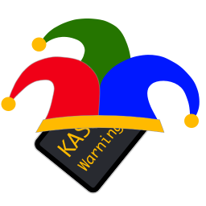

#Konsole Kasperl

_A little macOS utility that warns you if Console.app is running in the background._

Do you know the feeling when your mac seems to grind to a halt, especially during compiling, but later it turns out that you simply forgot that `Console.app` was running in the background? That `git bisect` would have finished in a fraction of the time...

Well, I've finally had enough and wrote me a utility that warns me when the **Console is clowning around in the background**. 

If Console is running in the background for some amount of time, Kasperl will post a notification. You can choose to quit Console directly from the notification. If you ignore it, Kasperl will increase the amount of time after which it will warn you again.

